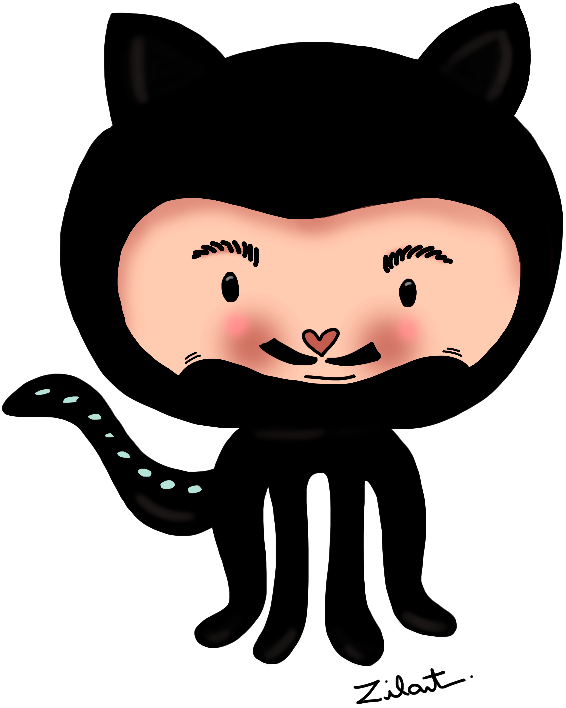

## Hi there  

I’m currently working at [bornlogic](https://www.bornlogic.com) on gerentes**digitais** 

I 💜 front-end and my currently tech stack includes:

You can find me on:

> *If you want a custom octocat like this one, you should talk to [Zilart](https://www.instagram.com/omundoealasanha/) 😉*
